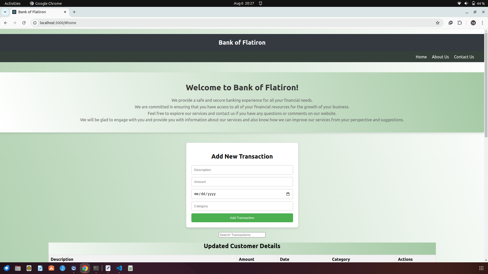
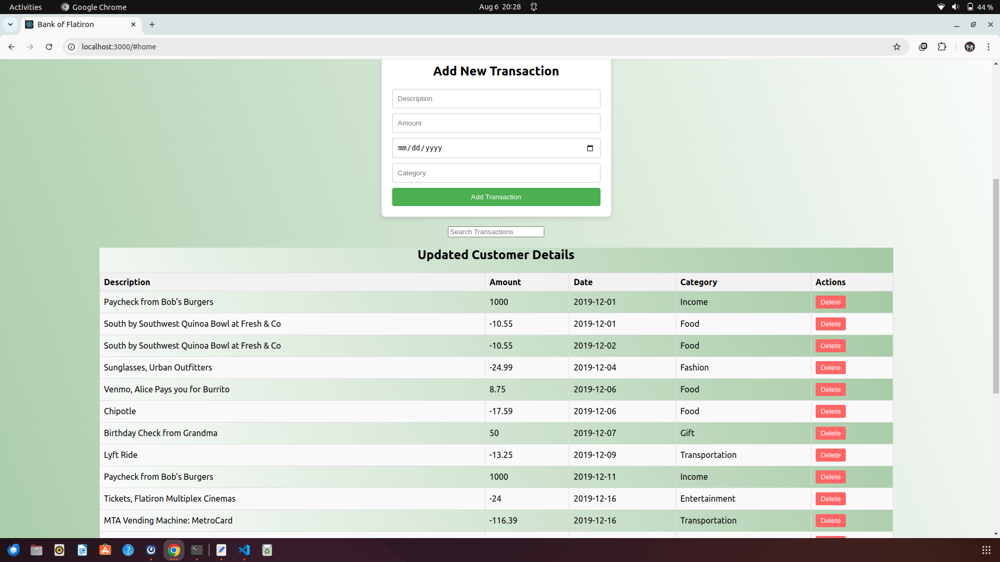
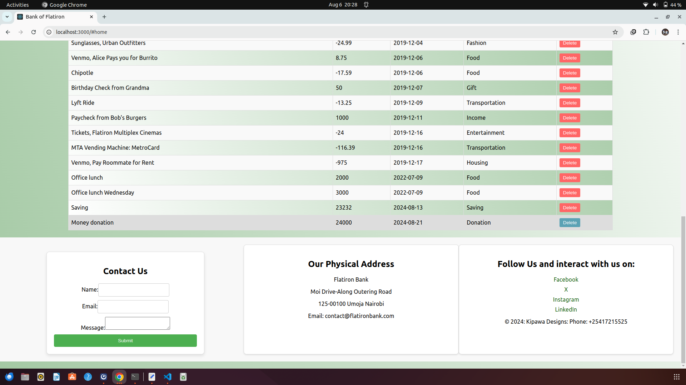

# Getting Started with Create React App

This project was bootstrapped with [Create React App](https://github.com/facebook/create-react-app).

## Available Scripts

### Accessing and using this React App

Create a React directory from the terminal using this command `mkdir bankofflatiron`
After creating the directory run `cd bankofflatiron`
While at this directory open your browesr to access my github account [git@github.com:Kenedy4/bankofflatironapp.git]
Fork the repository and clone it to your repository using `git clone git@github.com:Kenedy4/bankofflatironapp.git` on your terminal.
After cloning use `cd Kenedy4/bankofflatironapp` on your terminal.
Executing the above steps successfully will get you ready to start using the bankofflatiron app on your terminal.

In that project directory [Computer $ `bankofflatiron/Kenedy4/bankofflatironapp`], you can run:

### `npm start`

Runs the app in the development mode.\
Open [http://localhost:3000](http://localhost:3000) to view it in your browser.

The page will reload when you make changes.\
You may also see any lint errors in the console.

## `npx json-server --watch scr/db.json --port 8000` or `npx json-server --watch db.json --port 8000`

Runs the server in the development mode with the specified port number and server options as arguments.
Open [http://localhost:8000/transactions](http://localhost:8000/transactions) to view it in your browser.

### `npm test`

Launches the test runner in the interactive watch mode.\
See the section about [running tests](https://facebook.github.io/create-react-app/docs/running-tests) for more information.

### `npm run build`

Builds the app for production to the `build` folder.\
It correctly bundles React in production mode and optimizes the build for the best performance.

The build is minified and the filenames include the hashes.\
Your app is ready to be deployed!

See the section about [deployment](https://facebook.github.io/create-react-app/docs/deployment) for more information.

### `npm run eject`

**Note: this is a one-way operation. Once you `eject`, you can't go back!**

If you aren't satisfied with the build tool and configuration choices, you can `eject` at any time. This command will remove the single build dependency from your project.

Instead, it will copy all the configuration files and the transitive dependencies (webpack, Babel, ESLint, etc) right into your project so you have full control over them. All of the commands except `eject` will still work, but they will point to the copied scripts so you can tweak them. At this point you're on your own.

You don't have to ever use `eject`. The curated feature set is suitable for small and middle deployments, and you shouldn't feel obligated to use this feature. However we understand that this tool wouldn't be useful if you couldn't customize it when you are ready for it.

# Other Essential Details About this Application

## Project Requirements and Features

The project should allow allow user to post a new bank transaction to their account.
The user can filter the transaction with discription keywords through the search button.
A user can delete a transaction from the json database.
A user can send message to the bank through its official social network.

## System Interaction

Once you have run `npm start` and `npx json-server --watch scr/db.json --port 8000` or `npx json-server --watch db.json --port 8000` you should see the landing page as follows:
[  ]

### NOTE:

    This program is not live, however, it is mimicking a real live-application of a subsection of a bank component or functionality. Therefore, It allows the user to simulate bank operations.

## Usefullness of the application

This application can be used in any bank that needs to allow user interaction with their systems.

# License

This application licensed under the GNU General Public License v3.0
